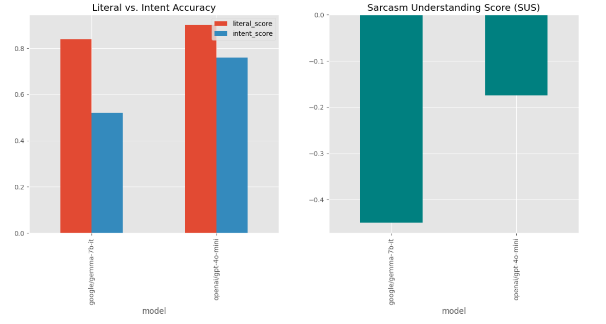

# technical-sarcasm-benchmark
TPSR Benchmark: Evaluating the Pragmatic Gap between Literal and Intent Understanding in Technical Sarcasm for LLMs.

-----

# TPSR: Technical Pragmatics & Sarcasm Reasoning Benchmark 🧠 

[(https://opensource.org/licenses/MIT)]
[(https://www.python.org/)]

### **Can Large Language Models (LLMs) understand what we *actually* mean?**

**TPSR (Technical Pragmatics & Sarcasm Reasoning)** is a specialized benchmark designed to evaluate the social cognition of LLMs within software development environments. It specifically measures the **Pragmatic Gap**—the divergence between a model's literal semantic processing and its ability to recognize sarcastic intent in technical feedback.

-----

## Key Features 🚀

  * **Dual-Axis Evaluation:** Separate tracking for *Literal Meaning* vs. *Actual Intent*.
  * **The "Literal Trap" Analysis:** Categorizes instances where models understand the words but fail the context.
  * **SUS Metric:** Introduces the *Sarcasm Understanding Score* ($SUS = Accuracy_{Intent} - Accuracy_{Literal}$).
  * **50 High-Fidelity Scenarios:** Covering Code Reviews, DevOps failures, and Architectural disputes.

-----

## Methodology: The Literal Trap 📊

Standard benchmarks often overlook "social blindness" in AI. TPSR identifies specific failure modes:

| Failure Mode | Literal Score | Intent Score | Description |
| :--- | :---: | :---: | :--- |
| **Correct** | ✅ | ✅ | Model understands both layers perfectly. |
| **Literal Trap** | ✅ | ❌ | Model treats sarcasm as genuine technical advice. |
| **Over-Interpretation** | ❌ | ✅ | Model sees intent where there is only a literal fact. |
| **Total Failure** | ❌ | ❌ | Model fails at both semantic and pragmatic levels. |

-----

##  Visual Insights📈

Graphical performance analysis of the Models:



-----

## Getting Started 🛠️

### Installation

```bash
git clone https://github.com/[KULLANICI_ADIN]/[REPO_ADIN].git
cd [REPO_ADIN]
pip install -r requirements.txt
```

### Run Evaluation

```bash
# To run the simulation and generate metrics
python scripts/evaluate_models.py
```

-----

## Dataset Sample 🧪 

```csv
id,text,literal_target,intent_target,type,difficulty
1,"Junior: 'I pushed to prod.' Senior: 'Fantastic. Who needs testing?'","Testing is unnecessary","sarcastic","sarcasm","easy"
```

-----

## Conclusion 🏁

The results show a significant **-30% to -50% drop** in accuracy when models transition from literal statements to sarcastic technical feedback. This highlights a critical need for **Pragmatic Reasoning** in the next generation of AI collaborators.

-----

## 👤 Author

**[Sude Yaren Kacar]**

  * LinkedIn: [(https://www.linkedin.com/in/sudeyarenkacar02/?locale=en)]
  * Portfolio: [https://sudekacar.github.io/sudeyarenkacarportfolio/]
  * Startup: **Qybit Labs** [https://qybitlabs.com/]

-----
